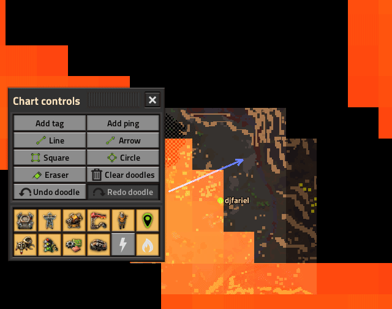

# Extensible Map Overlay Framework

Factorio **library mod** that extends the map **Chart Controls** panel. Other mods register overlay toggles, action buttons, and map placement tools through EMOF instead of reimplementing panel layout or cursor management.

**This mod does nothing on its own** - enable it only when a dependent mod requires it.

**Note on ping and tag:** The built-in ping and tag map tools are reimplemented within the modding API. I'm aware they lose a little UX compared to vanilla; they are the best they can be.

Ship `thumbnail.png` in the mod root for the in-game mod browser and Mod Portal icon.

**Mod Portal:** player-facing text is in `description.md` (uploaded via FMTK **Details**, not shipped in the release zip). This README is for the repository.

## For mod authors

Integration guide: **[documentation.md](documentation.md)** - quickstarts, API reference, events, and common mistakes.

Runnable reference buttons: companion mod **[EMOF Examples](https://mods.factorio.com/mod/emof-examples)** ([source](../emof-examples/)).

Add `extensible-map-overlay-framework` to your mod dependencies.

## For players

Install when a mod you use lists EMOF as a dependency. Open the map in chart view and use **Chart Controls** for overlays, actions, and tools from those mods.

## Screenshots

Action buttons from the **Doodle** mod in Chart Controls. EMOF supplies the panel; dependent mods supply the features.

Overlay toggles from an unannounced mod.

## Changelog

Portal format: [changelog.txt](changelog.txt).
