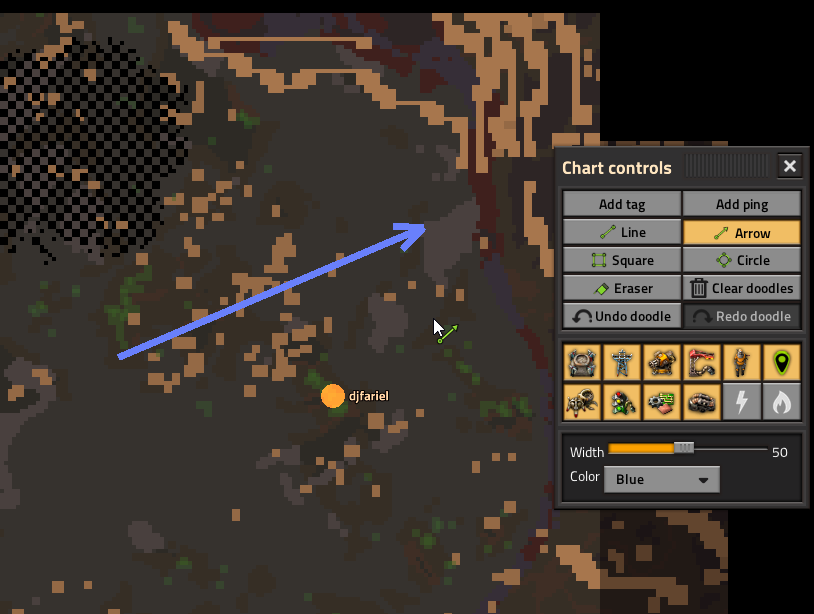

# Extensible Map Overlay Framework

*(because emo-f, get it? It stands for extensible map overlay - framework. don't worry, the ai-generated girl isn't related)*

**Library mod for Factorio 2.0.** EMOF extends the map **Chart Controls** panel so other mods can register overlay toggles, action buttons, and cursor-based map tools - without each mod reimplementing panel layout, toggle state, or cursor equip/cancel.

**This mod does nothing on its own.** Install it when another mod lists `extensible-map-overlay-framework` as a dependency. By itself, EMOF only re-hosts vanilla Chart Controls overlay layers in one panel and includes built-in ping and tag tools that demonstrate the framework API. There is no standalone gameplay or content.

**Note on ping and tag:** I'm aware those built-in tools lose a little UX compared to vanilla. I had to reimplement them within the bounds of the modding API, and they are the best they can be.

## With dependent mods

When a mod that uses EMOF is enabled, open the map in chart view and use **Chart Controls** for that mod's overlays, shortcuts, and placement tools. EMOF supplies the shared panel; dependent mods supply the actual features.

## Screenshots

Action buttons from the **Doodle** mod in Chart Controls.

Overlay toggles from an unannounced mod.

Those examples come from dependent mods, not from EMOF on its own.

## Mod authors

Integration guide: [documentation.md](https://github.com/djfariel/extensible-map-overlay-framework/blob/main/documentation.md) in the [source repository](https://github.com/djfariel/extensible-map-overlay-framework). Runnable reference buttons live in the companion mod **emof-examples**.
